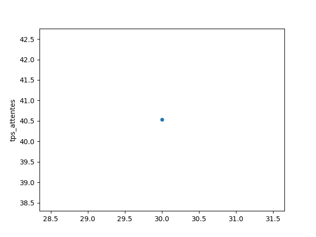

# Projet de Simulation d'événements discrets

## __Partie 1__ Plan d'expériences

__Tâche 1__ Le système modélisé est du type sans arrêt. L'état initial du réseau de files d'attentes est vide. On a donc besoin du temps de "réchauffage" pour que le système arrive dans l'état "normal". Indiquer les manipulations que vous utilisez pour récuprer les résultats suivants :
* Moyenne de temps de séjour
* Moyenne de temps d'attente
* Nombre moyen de clients en attente sur chaque file d'attente

```py
tps_sejours = []
tps_attentes = []
nb_moy = {'node_1':[], 'node_2': [], 'node_3': [], 'node_4':[] }

for a in range(10,40, 3):
    I=0.0001 
    Y=0.0001
    R=10000 
    S=1500 
    A=a 
    C=707 
    B=16 
    F=42.2 
    N= ciw.create_network(
            arrival_distributions=[ ciw.dists.Exponential(rate=A),#SI 
                                    ciw.dists.NoArrivals(),#SR   
                                    ciw.dists.NoArrivals(),#SS 
                                    ciw.dists.NoArrivals()],#SC 
            service_distributions=[ ciw.dists.Deterministic(value=I),#SI 
                                    ciw.dists.Exponential(rate=1/(Y+B/R)),#SR 
                                    ciw.dists.Deterministic(value=B/S),#SS 
                                    ciw.dists.Deterministic(value=B/C)],#SC 
            routing=[[0, 1, 0, 0], 
                        [0, 0, 1, 0], 
                        [0, 0, 0, 1], 
                        [0, B/F, 0, 0]], 
            number_of_servers=[1, 1, 1, 1] 
        ) 
    ciw.seed(randint(0,10000))
    Q = ciw.Simulation(N)
    Q.simulate_until_max_time(1440)
    recs = Q.get_all_records()

    #l = [rec for rec in recs if   rec.destination==-1]

    prechauff = [rec.id_number for rec in recs if rec.node == 1 and rec.arrival_date <= PRECHAUFFAGE_TIME]
    id_clients = [rec.id_number for rec in recs if rec.destination ==-1 and rec.id_number not in prechauff]

    node_1 = rec_to_df([
        rec for rec in recs if rec.node==1 and rec.id_number not in prechauff])
    node_2 = rec_to_df([
        rec for rec in recs if rec.node==2 and rec.id_number not in prechauff])
    node_3 = rec_to_df([
        rec for rec in recs if rec.node==3 and rec.id_number not in prechauff])
    node_4 = rec_to_df([
        rec for rec in recs if rec.node==4 and rec.id_number not in prechauff])

    travel_time =[]

    # temps de sejours
    for id_client in id_clients:
        travel_time.append(node_4[node_4.id_number==id_client].exit_date.iloc[0] - node_1[node_1.id_number==id_client].arrival_date.iloc[0])
    print("travel_time : ",moyenne(travel_time))
    tps_sejours.append(moyenne(travel_time))

    # nb moyen de client en attente dans chaque noeud
    nb_moy['node_1'].append(node_1.queue_size_at_arrival.mean())
    nb_moy['node_2'].append(node_2.queue_size_at_arrival.mean())
    nb_moy['node_3'].append(node_3.queue_size_at_arrival.mean())
    nb_moy['node_4'].append(node_4.queue_size_at_arrival.mean())

    # temps d'attente
    tps_attentes.append(node_1.waiting_time.mean() + node_2.waiting_time.mean() + node_3.waiting_time.mean() + node_4.waiting_time.mean())
```



__Tâche 2__ Pour la méthode de réplication, indiquer le nombre de réplications (répétitions) et la précision que vous décidez d'utiliser

```py
travel_time :  0.04247423310584784
travel_time :  0.04714675496060644
travel_time :  0.054179825169396977
travel_time :  0.0660937396461154
travel_time :  0.08942652593357281
travel_time :  0.15911176857946824
travel_time :  6.550632389742963
travel_time :  51.94007488562579
travel_time :  88.74345843387536
travel_time :  122.33029584992336
Travel time :  178.18078272575477 
```

__Tâche 3__ Pour la méthode de moyenne par lots, indiquer le nombre de lots, la largeur de lot et la procédure que vous allez exécuter

## __Partie 2__ Estimation des mesures de performance absolues

__Tâche 1__ Estimer les valuers absolues des mesures de performances suivantes pour le réseau de files d'attentes (A=30)

